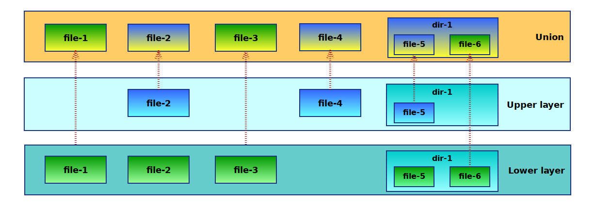

---

## 1. What is Docker?

***

### Packaged software
Collect everything in one package

***

### Isolated dependencies
Packages and depencies do not depend on the OS

***

### Immutable distribution 
Runs the same on any system

---

## 2. How to run Docker containers

***

## Exercise 1

---

## 3. Creating images

Images are built once, shared to a container registry and then run in exactly the state they were built.

***

## Demo

***

## Dockerfile

```dockerfile
# Container base image
FROM node:alpine

WORKDIR /app/
# Copy files into container
COPY app.js package.json ./

# Execute command in container build
RUN npm install

# What to run when finished container will be started
ENTRYPOINT ["node"]

# What arguments to pass to ENTRYPOINT
# This is what will be overridden with the arguments after:
# `docker run <image>`
CMD ["app.js"]
```

***

## Uploading to a container registry
(docker hub in this case)

```sh
$ docker login

$ docker build myapp .

$ docker tag myapp 0.0.0.0:5000/myapp:v1.0

$ docker push myapp
The push refers to repository [0.0.0.0:5000/newapp]
d0ee75f51314: Layer already exists
7bff100f35cb: Layer already exists
latest: digest: sha256:7deec43013ea79005c342b407e37f42061dc638351512ad6cfec3b754a48a023 size: 739

```

***

## Exercise 2

Build a container, upload it to Docker hub and let someone else run it.

---

## 4. How does docker work?

***

### Containers vs Virtual Machines


***

> "There is no such thing as a docker container"

***

### Collection of multiple components:
- Linux namespaces (processes, network, ipc, filesystem mounts, uts)
- Linux cgroups (share and limit system resources)
- Union file systems

***

### UnionFS

Collection of layers that is merged.



***

### Dockerfiles and layers

```dockerfile
FROM alpine               # Imports all alpine layers

ENV VARIABLE=1

RUN apk add --no-cache \  # Adds layer
      gcc \
      musl-devel

WORKDIR /build

COPY app.c .              # Adds layer

RUN gcc app.c -o app      # Adds layer

RUN rm /build/app.c       # Adds layer
```

***

### Resulting layers

```shell
$ docker history mycontainer
IMAGE         SIZE    CREATED        CREATED BY
11ee288f5f19  0B      5 seconds ago  rm /build/app.c
81dd9aa5cd37  10.6kB  6 seconds ago  gcc app.c -o app
2325e01d7bb1  74B     7 seconds ago  #(nop) COPY file:d64b9f772e…
4bf273c2caa0  0B      7 seconds ago  #(nop) WORKDIR /build
69a543fbcef9  96.1MB  8 seconds ago  apk add --no-cache gcc musl…
fb7b25d25519  0B      7 minutes ago  #(nop)  ENV VARIABLE=1
3f53bb00af94  0B      4 weeks ago    #(nop)  CMD ["/bin/sh"]
<missing>     4.41MB  4 weeks ago    #(nop) ADD file:2ff00caea4e…
```

***

### Open Container Initiative

- Runtime specification
- Image specification
- Registry specification

***

### Other container runtimes:

- LXC/LXD
- Cri-O
- Podman
- rkt
- more ...

---

## 5. docker-compose

so cool

```yml
version: '3'

services:

  registry:
    image: registry
    ports:
      - 5000:5000
    volumes:
      - data:/var/lib/registry
      - ./config.yml:/etc/docker/registry/config.yml

volumes:
  data:
```

***

## Exercise 3

---

## Container orchestration

***

Now that we have built our Docker configurations, and decided what we are going to run. Let's go straight to prod!

All is gonna be great, right? Docker solves everything!

***

Up until your server goes down and your containers fail at 3am. Shit.

***

Notification goes off, and you hop out of bed to:

```
$ ssh server
$ docker restart container

```

'cuz that's what we do, right?
***

- Alright, but what if I had a Loadbalancer with multiple servers looking after my containers?
- Sure, but what if they fail?


***

What if there was a better way to restart, scale, reprovision or take care of your applications when your containers, or even servers hosting the containers, fail?

***

Can you guess where this is going?

***


***

Just kidding, we aren't going to use Kubernetes.

Sorry.

(But why?)

***

But we are going to use something!

***

We are going to use **Consul** and **Nomad** to look after our applications
(Notice I say applications, not _containers_)

***

What! What?  

***

### Consul for 'Service Discovery'


***

### Nomad for applications and containers


***

### Demo 
