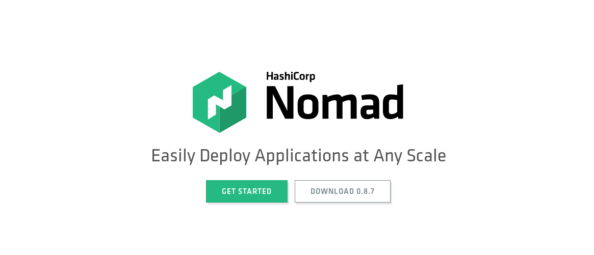
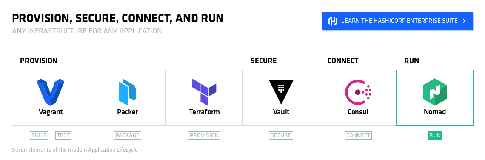

Waiting? Check these out!

- https://github.com/veggiemonk/awesome-docker
- https://blog.jessfraz.com/post/docker-containers-on-the-desktop/

---

github.com/r0bobo/L10-docker

---

## 1. What is Docker?
__Let's start easy__

***

Docker is an application that lets you run software packages that can contain all of your tools, libraries, configuration files, and helper applications.

***
It is developed predominantly for Linux, but can also be run on macOS and Windows.

***

The technology in use is a kind of __Operating System Level Virtualisation__, which is different to __Hardware Level Virtualisation__

***

**OS Level:** Docker, FreeBSD Jails, Solaris Containers, rkt

**Hardware Level:** VirtualBox, VMWare, KVM
***
_TL;DR Docker containers requires a host OS to run on_

***

This means containers are meant to be super small, nimble and portable. Without being made into full-blown VMs.

***

### Uses
- Packaging applications for deployment to environments
- Building a development environment per tool (Python with all your requirements)
- Sharing fully packaged applications between people
***

An application running with Docker is called a 'container', with the multiple being 'containers'

(_not 'Dockers' 'cuz that's a brand of khaki trousers_)
***

Images are the format that Docker uses to distribute applications. Your requirements, being your tools, libraries and so on, are packaged into an image.

***

Alright, so how do I use it?

---

## 2. How to run Docker containers

***

## Exercise 1

What better way to get going, than to have you do it?

```
  $ docker run --name nginx -p 80:80 nginx
  $ docker ps -a
  $ docker images -a
  $ docker inspect nginx
  $ docker stop nginx
  $ docker system prune -f -a

```

---

## 3. Creating images

Images are built once, shared to a container registry and then run in exactly the state they were built.

***

### Demo

***

### Dockerfile

```dockerfile
# Container base image
FROM node:alpine

WORKDIR /app/
# Copy files into container
COPY app.js package.json ./

# Execute command in container build
RUN npm install

# What to run when finished container will be started
ENTRYPOINT ["node"]

# What arguments to pass to ENTRYPOINT
# This is what will be overridden with the arguments after:
# `docker run <image>`
CMD ["app.js"]
```

***

### Uploading to a container registry
(docker hub in this case)

```sh
$ docker login

$ docker build --tag myapp .

$ docker tag myapp jbjorkang/myapp

$ docker push --tag myapp
The push refers to repository [docker.io/jbjorkang/myapp]
d0ee75f51314: Layer already exists
7bff100f35cb: Layer already exists
latest: digest: sha256:7deec43013ea79005c342b407e37f42061dc638351512ad6cfec3b754a48a023 size: 739

```

***

### Exercise 2

Build a container, upload it to Docker hub and let someone else run it.

---

## 4. How does docker work?

***

### Containers vs Virtual Machines


***

> "There is no such thing as a docker container"

***

### Collection of multiple components:
- Linux namespaces (processes, network, ipc, filesystem mounts, uts)
- Linux cgroups (share and limit system resources)
- Union file systems

***

### UnionFS

Collection of layers that is merged.


***

### Dockerfiles and layers

```dockerfile
FROM alpine               # Imports all alpine layers

ENV VARIABLE=1

RUN apk add --no-cache \  # Adds layer
      gcc \
      musl-devel

WORKDIR /build

COPY app.c .              # Adds layer

RUN gcc app.c -o app      # Adds layer

RUN rm /build/app.c       # Adds layer
```

***

### Resulting layers

```shell
$ docker history mycontainer
IMAGE         SIZE    CREATED        CREATED BY
11ee288f5f19  0B      5 seconds ago  rm /build/app.c
81dd9aa5cd37  10.6kB  6 seconds ago  gcc app.c -o app
2325e01d7bb1  74B     7 seconds ago  #(nop) COPY file:d64b9f772e…
4bf273c2caa0  0B      7 seconds ago  #(nop) WORKDIR /build
69a543fbcef9  96.1MB  8 seconds ago  apk add --no-cache gcc musl…
fb7b25d25519  0B      7 minutes ago  #(nop)  ENV VARIABLE=1
3f53bb00af94  0B      4 weeks ago    #(nop)  CMD ["/bin/sh"]
<missing>     4.41MB  4 weeks ago    #(nop) ADD file:2ff00caea4e…
```

***

### Runtime layer

- Runtime changes stored in layer on top of image
- Discarded when container stops

***

### Open Container Initiative

- Runtime specification
- Image specification
- Registry specification

***

### Other container runtimes:

- LXC/LXD
- Cri-O
- Podman
- rkt
- more ...

***

### What does the future hold for containers?

***

### Virtual machines!

***

### Multi tenancy and isolation

Container isolation is (probably) not be good enough to trust multiple customers, systems, etc on on the same nodes.

***

### Micro-VMs

Thin virtualization. (Firecracker has 5MB memory overhead and 125ms startup time)

- Firecracker (Amazon Lambda)
- Kata containers
- gVisor

---

## 5. Docker Compose

***
YAML for everyone!
***

So we _could_ run a series of _docker run_ commands to run our containers, or we could create a long shell or Python script to do it, but as luck would have it..
***


There's an even nicer way that Docker built:

```yml
version: '2'

services:

  elasticsearch:
    build:
      context: elasticsearch/
      args:
        ELK_VERSION: $ELK_VERSION
    volumes:
      - ./elasticsearch/config/elasticsearch.yml:/usr/share/elasticsearch/config/elasticsearch.yml:ro
    ports:
      - "9200:9200"
      - "9300:9300"
    environment:
      ES_JAVA_OPTS: "-Xmx256m -Xms256m"
    networks:
      - elk

  logstash:
    build:
      context: logstash/
      args:
        ELK_VERSION: $ELK_VERSION
    volumes:
      - ./logstash/config/logstash.yml:/usr/share/logstash/config/logstash.yml:ro
      - ./logstash/pipeline:/usr/share/logstash/pipeline:ro
    ports:
      - "5000:5000"
      - "9600:9600"
    environment:
      LS_JAVA_OPTS: "-Xmx256m -Xms256m"
    networks:
      - elk
    depends_on:
      - elasticsearch

  kibana:
    build:
      context: kibana/
      args:
        ELK_VERSION: $ELK_VERSION
    volumes:
      - ./kibana/config/:/usr/share/kibana/config:ro
    ports:
      - "5601:5601"
    networks:
      - elk
    depends_on:
      - elasticsearch

networks:

  elk:
    driver: bridge

```
***

That example creates:
- networks
- images
- adds volumes (from the local disk)
- containers

and links them all together.

***

## Exercise 3
_(More of a demo really)_

---

## 6. Container orchestration

***

Now that we have built our Docker configurations, and decided what we are going to run. Let's go straight to prod!

All is gonna be great, right? Docker and Docker-compose solves everything!

***

Up until your server goes down and your containers fail at 3am. Shit.

***

Notification goes off, and you hop out of bed to:

```
$ ssh server
$ docker restart container

```
or

```
$ docker-compose up -d
```

'cuz that's what we do, right?
***

## Nah.

_"Alright, but what if I had a Loadbalancer with multiple servers looking after my containers?"_

_"Sure, but what if they fail?"_


***

What if there was a better way to restart, scale, reprovision or take care of your applications when your containers, or even servers hosting the containers, fail?

***

Can you guess where this is going?

***


***

Just kidding, we aren't going to use Kubernetes.

Sorry.

(But why?)

***

But we are going to use something!

***



***

We are going to use **Consul** and **Nomad** to look after our applications
(Notice I say applications, not _containers_)

***

What! What?  

***

You may have heard of a small company called Hashicorp?



***
### Consul for 'Service Discovery'


***

### Nomad for applications and containers


***

### Demo

***

## Q&A
